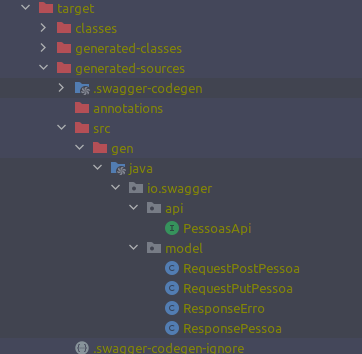
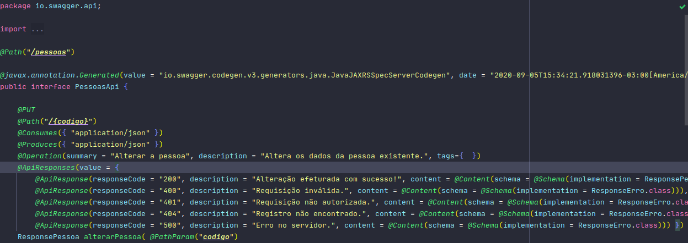
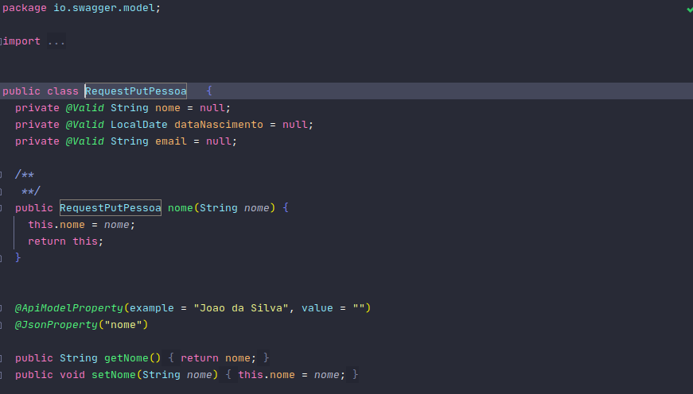

<div align="center">


</div>

<div align="center">

# POC - API FIRST com Quarkus e Java
Trata-se de uma aplicação de prova de conceito para aplicar Api First utilizando Quarkus e Java e Swagger


</div> 

## Fundamentos teóricos

> API First: API first significa que a Application Programming Interface  é uma estratégia na qual a primeira ordem dos negócios é desenvolver uma API que coloque os interesses do desenvolvedor de destino em primeiro lugar e depois construa o produto sobre ele (seja um site, aplicativo móvel ou software SaaS). Ao desenvolver APIs com os desenvolvedores em mente, você e seus desenvolvedores estão economizando muito trabalho enquanto estabelecem as bases para que outros possam desenvolver.

> Quarkus: O Quarkus é uma estrutura de aplicativo Java completa, nativa do Kubernetes, adaptada para OpenJDK HotSpot e GraalVM. Comparativamente a outros frameworks, como Spring, ele oferece um pequeno consumo de memória e tempo de inicialização reduzido. Ele permite combinar código imperativo e estilo reativo não bloqueador.

> Swagger: Swagger é uma linguagem de descrição de interface para descrever APIs RESTful expressas usando JSON. O Swagger é usado junto com um conjunto de ferramentas de software de código aberto para projetar, construir, documentar e usar serviços da Web RESTful.

> Java: Java é uma linguagem de programação orientada a objetos desenvolvida na década de 90 por uma equipe de programadores chefiada por James Gosling, na empresa Sun Microsystems. Em 2008 o Java foi adquirido pela empresa Oracle Corporation.


## Integração contínua
[](https://travis-ci.org/wesleyosantos91/poc-api-first-quarkus)

[](https://sonarcloud.io/dashboard?id=wesleyosantos91_poc-api-first-quarkus)

[](https://sonarcloud.io/dashboard?id=wesleyosantos91_poc-api-first-quarkus)

[](https://sonarcloud.io/dashboard?id=wesleyosantos91_poc-api-first-quarkus)
[](https://sonarcloud.io/dashboard?id=wesleyosantos91_poc-api-first-quarkus)
[](https://sonarcloud.io/dashboard?id=wesleyosantos91_poc-api-first-quarkus)

[](https://sonarcloud.io/dashboard?id=wesleyosantos91_poc-api-first-quarkus)

[](https://sonarcloud.io/dashboard?id=wesleyosantos91_poc-api-first-quarkus)

[](https://sonarcloud.io/dashboard?id=wesleyosantos91_poc-api-first-quarkus)
[](https://sonarcloud.io/dashboard?id=wesleyosantos91_poc-api-first-quarkus)
[](https://sonarcloud.io/dashboard?id=wesleyosantos91_poc-api-first-quarkus)

[](https://sonarcloud.io/dashboard?id=wesleyosantos91_poc-api-first-quarkus)

# License


## Tecnologias
- Java 11
- quarkus 1.7.0.Final
  - quarkus-resteasy
  - quarkus-resteasy-json
  - quarkus-hibernate-orm
  - quarkus-hibernate-orm-panache
  - quarkus-flyway
  - quarkus-jdbc-mysql
  - quarkus-hibernate-validator
  - quarkus-rest-client
  - quarkus-smallrye-openapi
  - quarkus-junit5
  - rest-assured
  - testcontainers
  - approvaltests
- Git
- MYSQL

## Execução

> O Conceito é aplicado com o puglin *swagger-codegen-maven-plugin* onde o mesmo ler o arquivo api.yml, e gera a interface e as entidades com toda documentação baseado no designer da API
```xml
    <plugin>
       <groupId>io.swagger.codegen.v3</groupId>
       <artifactId>swagger-codegen-maven-plugin</artifactId>
       <version>3.0.8</version>
       <executions>
          <execution>
             <goals>
                <goal>generate</goal>
             </goals>
             <configuration>
                <inputSpec>${project.basedir}/src/main/resources/swagger/api.yml</inputSpec>
                <language>jaxrs-spec</language>
                <output>${project.build.directory}/generated-sources</output>
                <generateApiTests>false</generateApiTests>
                <generateModelTests>false</generateModelTests>
                <configOptions>
                   <interfaceOnly>true</interfaceOnly>
                   <dateLibrary>java8</dateLibrary>
                   <java8>true</java8>
                </configOptions>
             </configuration>
          </execution>
       </executions>
       <dependencies>
          <dependency>
             <groupId>io.swagger.codegen.v3</groupId>
             <artifactId>swagger-codegen-generators</artifactId>
             <version>3.0.8</version>
          </dependency>
       </dependencies>
    </plugin>
```
##### Estrutura

##### Interface

##### Entidade


A execução das aplicações são feitas através do de um comando Maven que envoca a inicialização do Quarkus.

- Scripts
  ### Executar docker-compose
  - 1° comando: ``` cd src/main/docker/```
  - 2° comando: ```docker-compose -f docker-compose.yml up```
  ### Executar a aplicação
  -  ```./mvnw clean compile quarkus:dev```
  ### Executar testes
  -  ```./mvnw clean compile verify sonar:sonar```

# Utilização

## Swagger
http://localhost:8080/swagger-ui/#/

## Sonar
http://localhost:9000/